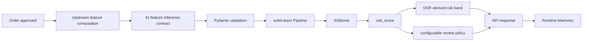

# E-commerce Delivery Delay Prediction

End-to-end machine learning system for predicting **late e-commerce deliveries at order approval time**, built on the Olist Brazilian E-Commerce dataset.

The project goes beyond model training: it covers data understanding, leakage-safe feature engineering, chronological validation, temporal cross-validation, XGBoost tuning, model diagnostics, explainability, drift analysis, FastAPI serving, Docker deployment, testing, and monitoring hooks.

> **Portfolio focus:** practical ML engineering under temporal distribution shift.

---

## Project Overview

Late deliveries affect customer satisfaction, support workload, seller performance, and fulfillment operations. The goal of this project is to identify risky orders **before delivery happens**, so an operations team can prioritize intervention.

### Prediction target

```text
late_delivery = 1
if actual_customer_delivery_date > estimated_delivery_date
else 0
```

### Prediction point

```text
order_approved_at
```

Only information available at or before this timestamp is allowed into the model.

### Modeling grain

```text
1 row = 1 order
```

### Final modeling population

| Metric | Value |
|---|---:|
| Orders | 96,450 |
| On-time deliveries | 88,627 |
| Late deliveries | 7,823 |
| Late-delivery rate | 8.11% |
| Model features | 41 |

---

## Why This Project Is More Than a Classifier

A random split would make this problem look easier than it really is.

Delivery behavior changes over time, so the project uses chronological validation and expanding-window temporal cross-validation. The evaluation phase also found meaningful drift in operational features, especially `promised_delivery_days`.

The resulting system is designed around five constraints:

1. **No target leakage**
2. **Chronological evaluation**
3. **Imbalanced-class metrics**
4. **Temporal drift awareness**
5. **Production-safe score semantics**

---

## Repository Structure

```text
.
├── app/                         # FastAPI application
├── configs/                     # Modeling, tuning and serving configs
├── data/
│   ├── raw/
│   ├── interim/
│   └── processed/
├── docs/
├── models/
├── notebooks/
│   ├── 00_dataset_understanding.ipynb
│   ├── 01_target_and_cleaning.ipynb
│   ├── 02_eda.ipynb
│   ├── 03_feature_engineering.ipynb
│   ├── 04a_model_baselines.ipynb
│   ├── 04b_temporal_cv_tuning.ipynb
│   ├── 05_model_evaluation.ipynb
│   └── 06_productionization.ipynb
├── reports/
│   ├── figures/
│   └── metrics/
├── src/
│   ├── features/
│   ├── models/
│   ├── monitoring/
│   └── serving/
├── tests/
├── Dockerfile
├── docker-compose.yml
├── Makefile
├── pyproject.toml
└── uv.lock
```

---

## End-to-End ML Workflow


---

## Data Understanding & Cleaning

The raw Olist dataset contains separate order, item, payment, product, seller, customer, review and geolocation tables.

Important data-design decisions:

- item/payment/product data are aggregated to order level before joining;
- customer and seller locations are converted into order-level geographic features;
- geolocation ZIP-prefix coordinates use median latitude/longitude;
- orders with invalid promise windows are excluded;
- only delivered orders with a known target and valid prediction timestamp are modeled;
- raw source files remain immutable.

### Modeling population funnel

The final cleaned population contains:

```text
96,450 orders
```

with:

```text
88,627 on-time
7,823 late
```

---

## Leakage Prevention

The prediction is made at `order_approved_at`.

Examples of prohibited model inputs:

```text
order_delivered_carrier_date
order_delivered_customer_date
delivery_delay_days
review information
final order status
any post-approval outcome information
```

The feature pipeline contains explicit leakage checks, and the processed model matrix contains no forbidden columns.

---

## Feature Engineering

The final model uses **41 features** across five groups.

### Time

Examples:

```text
purchase_month
purchase_weekday
purchase_hour
cyclical time encodings
approval_lag_hours
promised_delivery_days
```

### Order & items

```text
item_count
unique_products
seller_count
total_price
total_freight
freight_ratio
```

### Payments

```text
payment_records
payment_value
max_installments
primary_payment_type
```

### Products

```text
product weight
product volume
category count
dominant product category
```

### Geography

```text
customer_state
mean_distance_km
max_distance_km
same_state_seller_share
all_sellers_same_state
```

---

## Chronological Split

The project avoids random train/test splitting.

| Split | Orders | Late Rate |
|---|---:|---:|
| Train | 67,515 | 9.02% |
| Validation | 14,467 | 5.38% |
| Test | 14,468 | 6.58% |

This immediately reveals temporal distribution shift that a random split would hide.

---

## Baseline Modeling

Phase 4A compared:

- Dummy Classifier
- Logistic Regression
- Decision Tree
- Random Forest
- Histogram Gradient Boosting

The first validation winner was Random Forest:

```text
Validation PR-AUC: 0.1619
```

but its later-period performance degraded substantially. That result motivated a stronger temporal model-selection strategy.

---

## Temporal Cross-Validation & Tuning

Phase 4B combines the original train and validation periods into a development dataset and applies **4 expanding-window temporal folds**.

```text
Fold 1: past ───────► future block
Fold 2: past ───────────► future block
Fold 3: past ───────────────► future block
Fold 4: past ───────────────────► future block
```

A total of **22 configurations** were evaluated across:

- Logistic Regression
- Random Forest
- HistGradientBoosting
- XGBoost

### Selected development candidate

```text
Model: XGBoost
Config: xgboost_03
```

```text
n_estimators      = 300
max_depth         = 5
learning_rate     = 0.03
min_child_weight  = 5
subsample         = 0.85
colsample_bytree  = 0.85
reg_lambda        = 2.0
scale_pos_weight  = automatic per fold
```

### Temporal-CV result

| Metric | Value |
|---|---:|
| Mean PR-AUC | **0.2267** |
| PR-AUC std | 0.1145 |
| Mean ROC-AUC | 0.7198 |

XGBoost won narrowly over other boosted/tree candidates, so it is treated as the **selected development candidate**, not as an unquestionable global optimum.

---

## Evaluation

Because this is an imbalanced classification problem, **accuracy is not used as the main selection metric**.

Primary and supporting metrics:

```text
PR-AUC / Average Precision
PR-AUC lift over prevalence
ROC-AUC
Precision
Recall
F1
Brier score
Log loss
```

### Development OOF vs observed test diagnostic

| Metric | Development OOF | Observed Test |
|---|---:|---:|
| Rows | 40,991 | 14,468 |
| Positive rate | 10.08% | 6.58% |
| PR-AUC | **0.1907** | **0.1080** |
| PR-AUC lift | **1.89x** | **1.64x** |
| ROC-AUC | 0.6919 | 0.6796 |

The model retains useful ranking signal in the latest period, but performance weakens under temporal shift.

> The original test period was already observed during Phase 4A. It is therefore documented as an **observed holdout diagnostic**, not a pristine untouched final holdout.

---

## Threshold Analysis

Threshold selection is kept separate from ranking performance.

Development OOF produced two operating points:

| Policy | Threshold | Precision | Recall | F1 |
|---|---:|---:|---:|---:|
| Best OOF F1 | 0.5650 | 19.55% | 44.12% | 27.09% |
| Recall >= 50% | 0.5260 | 18.25% | 50.02% | 26.75% |

However, these thresholds did **not transfer reliably** to the later observed test period.

This leads to an important production decision:

> treat the model output primarily as a **risk-ranking score**, not as a stable calibrated probability or universally optimal fixed threshold.


---

## Calibration

Phase 5 showed strong probability overestimation.

The mean absolute calibration gap across calibration bins was approximately:

```text
0.2135
```

For that reason, the production API explicitly returns:

```json
{
  "calibrated_probability": false
}
```

and uses the name:

```text
risk_score
```

instead of `late_delivery_probability`.


---

## Explainability

Three complementary methods are included.

### XGBoost native importance

Useful for understanding how often/strongly transformed features contribute to tree decisions.


### Permutation importance

Measures the decrease in observed-test Average Precision after shuffling each raw feature.

The strongest raw feature was:

```text
promised_delivery_days
```

by a wide margin.


### SHAP

Global SHAP analysis highlights several important model components:

```text
purchase_month_cos
promised_delivery_days
customer_state_SP
distance features
same_state_seller_share
approval_lag_hours
```


These methods explain model behavior; they are **not causal-effect estimates**.

---

## Drift Analysis

Population Stability Index was used as a compact development-to-test diagnostic.

The strongest non-trivial operational drift signal was:

```text
promised_delivery_days
PSI ≈ 0.581
```

This is especially important because the same feature is also the strongest raw permutation feature.

That combination suggests a key production risk:

> the model depends heavily on the promised-delivery window, while the distribution of that feature changes meaningfully over time.

Calendar features show very large PSI values as expected because the holdout covers later months/years than the development period.

---

## Temporal Robustness

Performance varies substantially across periods.

For example, observed monthly diagnostics show that model discrimination weakened in the latest month:

| Period | Late Rate | ROC-AUC | PR-AUC Lift |
|---|---:|---:|---:|
| 2018-06 | 0.99% | 0.7956 | 4.33x |
| 2018-07 | 4.10% | 0.6627 | 2.18x |
| 2018-08 | 10.54% | 0.6171 | 1.26x |

This is why the project includes explicit monitoring hooks rather than treating training-time performance as permanent.

---

## Production Architecture



The FastAPI service intentionally does **not** perform all raw Olist joins online.

The serving boundary is the finalized 41-feature vector.

---

## API

Available endpoints:

```text
GET  /
GET  /health
GET  /model-info
GET  /monitoring/snapshot

POST /predict
POST /predict/batch
```

### Example prediction response

```json
{
  "order_id": "abc123",
  "request_id": "c5c6...",
  "risk_score": 0.61,
  "risk_band": "high",
  "requires_review": true,
  "action_threshold": 0.525952,
  "calibrated_probability": false,
  "model_version": "xgboost_03:..."
}
```

---

## Run Locally

### 1. Install dependencies

```bash
uv sync
```

### 2. Build deployment metadata

```bash
python -m src.serving.build_deployment_config
```

### 3. Run tests

```bash
pytest -q
```

Current project test suite:

```text
23 passed
```

### 4. Start FastAPI

```bash
fastapi dev app/main.py
```

Swagger:

```text
http://127.0.0.1:8000/docs
```

---

## Docker

Build:

```bash
docker build -t delivery-delay-api .
```

Run:

```bash
docker run --rm \
  -p 8000:8000 \
  delivery-delay-api
```

The container has been verified to:

- build successfully;
- load `xgboost_03`;
- start FastAPI;
- expose Swagger/OpenAPI;
- serve the production application on port `8000`.

Docker Compose is also included:

```bash
docker compose up --build
```

---

## Monitoring

The lightweight monitoring endpoint exposes runtime telemetry:

```text
total_requests
total_predictions
failed_requests
average_request_latency_ms
mean_risk_score
review_rate
risk_band_counts
missing_feature_values
```

Recommended production alerts include:

- score-distribution drift;
- review-rate drift;
- `promised_delivery_days` drift;
- feature missingness;
- latency/error spikes;
- realized late-delivery prevalence;
- future PR-AUC / PR-AUC lift;
- future calibration.

---

## Reproducibility

Core workflow:

```bash
uv sync

python -m src.features.build_features

python -m src.models.train

python -m src.models.tune

python -m src.models.analyze

python -m src.serving.build_deployment_config

pytest -q
```

Then:

```bash
fastapi dev app/main.py
```

or:

```bash
docker build -t delivery-delay-api .
docker run --rm -p 8000:8000 delivery-delay-api
```

---

## Key Engineering Decisions

| Decision | Reason |
|---|---|
| Prediction at approval time | Enables intervention before fulfillment completes |
| Aggregate before joins | Preserves `1 row = 1 order` |
| Explicit leakage registry | Prevents post-outcome features entering X |
| Chronological split | Reflects real future generalization |
| Temporal cross-validation | Reduces reliance on one validation window |
| PR-AUC as primary metric | Better suited to ~8% positive class |
| XGBoost candidate | Best mean temporal-CV PR-AUC |
| Risk score instead of probability | Phase 5 showed poor calibration |
| OOF-derived risk bands | Avoids defining bands from observed test |
| FastAPI + Pydantic | Explicit inference contract |
| Docker deployment | Reproducible serving environment |
| Runtime telemetry | Supports future drift/behavior monitoring |

---

## Limitations

This project intentionally documents its limitations.

- The Olist dataset is historical and reflects a specific marketplace and period.
- Important real-world logistics variables may be unavailable.
- Temporal distribution shift is substantial.
- `promised_delivery_days` is both highly predictive and strongly shifted.
- The selected model is not well calibrated.
- Fixed thresholds do not transfer reliably across periods.
- The original test period is an observed diagnostic rather than a pristine final holdout.
- Runtime telemetry is currently in-process memory rather than an external monitoring platform.
- The API assumes upstream infrastructure can reproduce the exact feature contract at order approval time.

---

## What I Would Improve Next

For a real production deployment, the next iterations would be:

1. introduce a dedicated online/offline feature contract or feature store;
2. collect additional carrier, warehouse and logistics features;
3. calibrate scores using a future development window;
4. consider top-N or capacity-based intervention instead of one fixed threshold;
5. add Prometheus/OpenTelemetry monitoring;
6. automate drift checks and retraining triggers;
7. introduce model registry/version promotion;
8. add CI/CD for tests, image builds and deployment;
9. evaluate performance on a truly untouched future period.

---

## Project Phases

```text
Phase 1  — Problem Definition                    ✓
Phase 2  — Data Preparation & EDA                ✓
Phase 3  — Feature Engineering                   ✓
Phase 4A — Baseline Modeling                     ✓
Phase 4B — Temporal CV + Hyperparameter Tuning   ✓
Phase 5  — Evaluation & Model Analysis           ✓
Phase 6  — Productionization & Deployment        ✓
Phase 7  — Documentation & Portfolio             ✓
```

---

## Skills Demonstrated

```text
Python
Pandas
NumPy
scikit-learn
XGBoost
SHAP
Matplotlib
Parquet
PyArrow
FastAPI
Pydantic
Docker
uv
pytest
Machine Learning
Feature Engineering
Imbalanced Classification
Temporal Cross-Validation
Model Explainability
Drift Analysis
ML Deployment
MLOps Fundamentals
```

---

## Documentation

Additional documentation:

- [`docs/project_definition.md`](docs/project_definition.md)
- [`docs/data_dictionary.md`](docs/data_dictionary.md)
- [`docs/model_card.md`](docs/model_card.md)
- [`docs/system_architecture.md`](docs/system_architecture.md)
- [`docs/reproducibility.md`](docs/reproducibility.md)
- [`docs/portfolio.md`](docs/portfolio.md)
- [`docs/deployment.md`](docs/deployment.md)

---

## Final Takeaway

The main lesson from this project is not that one algorithm achieved the highest metric.

It is that a useful ML system requires:

```text
correct prediction timing
+ leakage-safe features
+ realistic temporal validation
+ explicit uncertainty
+ explainability
+ drift awareness
+ reproducible deployment
```

The final XGBoost candidate provides useful delivery-risk ranking, while the evaluation also makes clear where the system is weak and what would need to be monitored before relying on it operationally.
