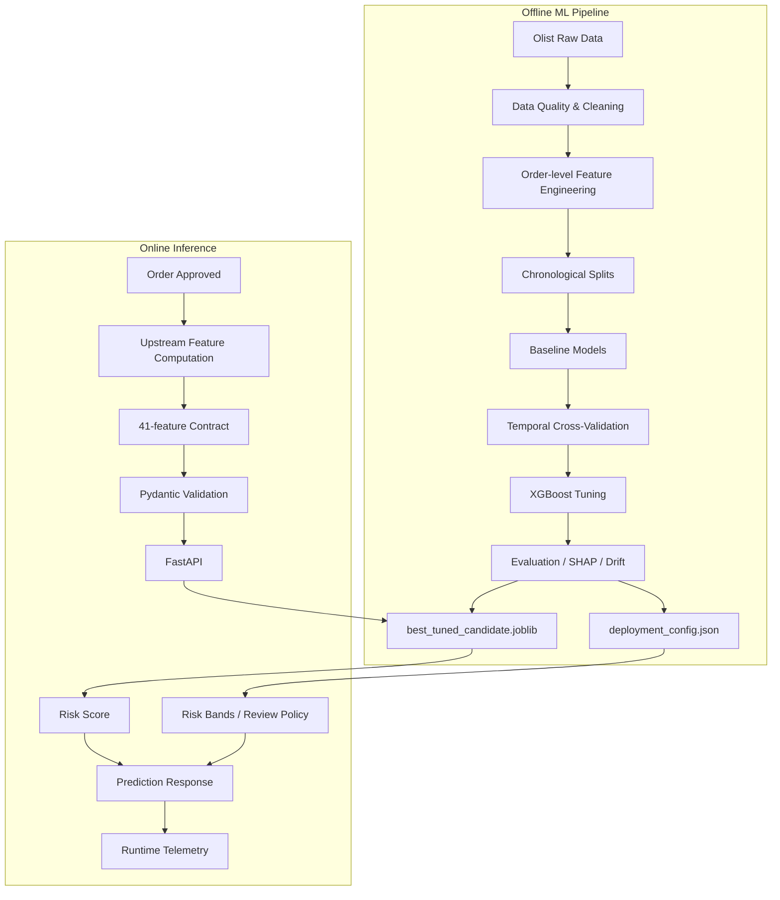
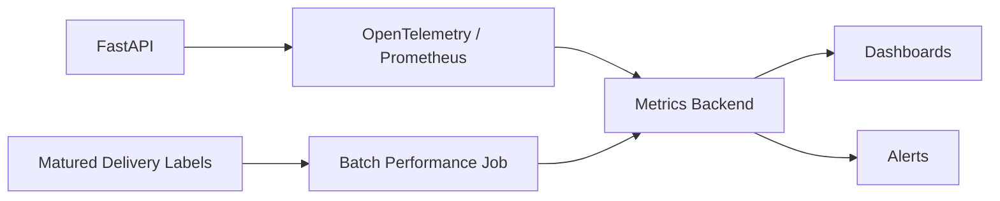

# System Architecture

## High-Level Architecture



---

## Offline Boundary

The offline pipeline owns:

- raw table joins;
- data quality rules;
- target construction;
- aggregation logic;
- geolocation processing;
- feature definitions;
- model selection;
- model tuning;
- evaluation;
- model serialization;
- deployment metadata.

---

## Online Boundary

The online API owns:

- request validation;
- exact 41-feature ordering;
- model loading;
- prediction;
- risk-band mapping;
- configurable review threshold;
- model version reporting;
- structured request logging;
- lightweight telemetry.

It does **not** perform expensive Olist joins per API call.

---

## Why the API Accepts Features Instead of Raw Orders

The source dataset contains multiple one-to-many relationships:

```text
orders
├── order_items
├── payments
└── reviews
```

and geographic/product/seller enrichment.

Performing those joins online would:

- increase request latency;
- introduce consistency risks;
- require access to many source systems;
- make offline/online feature parity harder;
- make each API call more fragile.

The project therefore defines the production boundary at the final feature vector.

A real platform would typically implement this with a feature service, shared feature library or feature store.

---

## Model Artifact Version

Deployment metadata includes the model candidate and SHA256 fingerprint.

Example:

```text
xgboost_03:<sha256-prefix>
```

This lets API responses identify the exact model artifact that generated a score.

---

## Score Semantics

```text
risk_score = model positive-class ranking score
```

It is **not** treated as a calibrated probability.

Risk bands are based on development temporal-OOF score quantiles:

```text
low      → <= OOF q50
medium   → <= OOF q80
high     → <= OOF q95
critical → > OOF q95
```

This avoids defining risk bands from the observed test period.

---

## Runtime Monitoring

Current in-process telemetry:

```text
request count
prediction count
failure count
average request latency
mean risk score
review rate
risk-band counts
missing feature values
```

Recommended production extension:



Future monitoring should include label-based model quality once outcomes mature.

---

## Container Deployment

```text
python:3.14-slim
+
uv locked environment
+
FastAPI
+
XGBoost model artifact
+
deployment metadata
```

The image has been verified to build and start successfully.

---

## Future Production Architecture

A larger production platform could evolve toward:

```text
Event / Order Service
        ↓
Feature Service
        ↓
Model API
        ↓
Operations Queue
        ↓
Monitoring / Feedback
        ↓
Label Store
        ↓
Scheduled Evaluation
        ↓
Retraining Pipeline
        ↓
Model Registry
        ↓
Controlled Promotion
```
